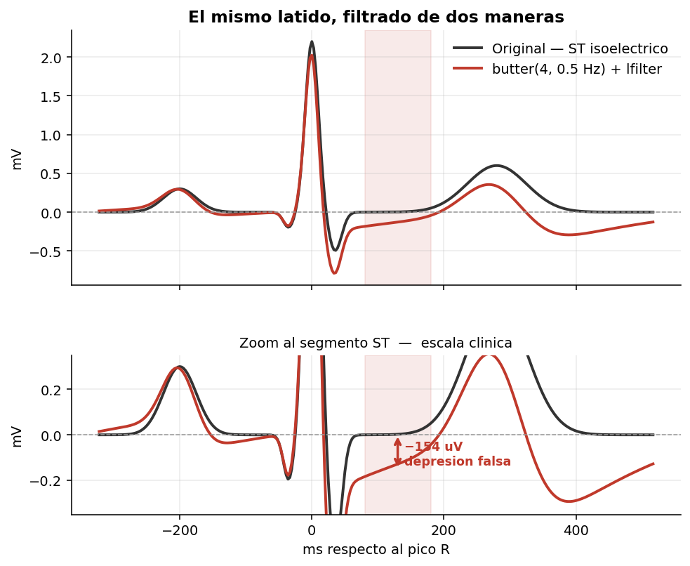
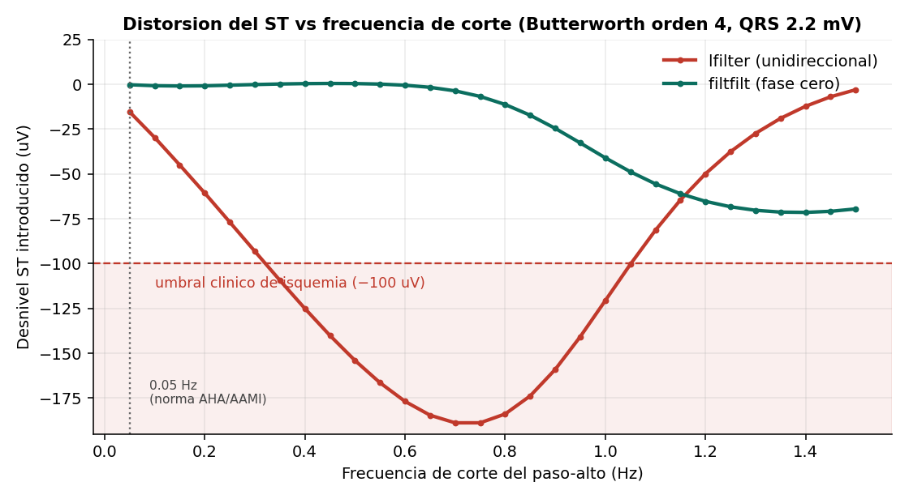

# Cómo filtrar mal un ECG simula una isquemia

Demostración reproducible de que la elección de un filtro paso-alto puede introducir en el ECG un desnivel del segmento ST **mayor que el umbral clínico de isquemia miocárdica**, sobre una señal cuyo ST vale exactamente cero.



## Resultado principal

Sobre un ECG sintético con segmento ST isoeléctrico por construcción (QRS de 2.2 mV, típico de V4):

| Configuración | Desnivel ST introducido |
|---|---|
| `butter(4, 0.50 Hz)` + `sosfilt` | **−154.0 µV** |
| `butter(2, 0.05 Hz)` + `sosfiltfilt` | +1.1 µV |

El criterio clínico de desnivel ST significativo es ±100 µV. La primera configuración lo supera sin que exista ninguna patología en la señal.

## El hallazgo

La frecuencia de corte no es el único culpable: lo determinante es la **no linealidad de fase**. El mismo filtro aplicado de forma bidireccional (fase cero) no produce distorsión apreciable.



Esto explica por qué la recomendación AHA fija 0.05 Hz para filtros convencionales pero permite hasta 0.67 Hz en filtros digitales de fase lineal: no son dos reglas, es la misma exigencia de preservación de fase expresada para dos tecnologías.

## Contenido

```
notebooks/filtrado_st_ecg.ipynb   Notebook completo, ejecutable de principio a fin
src/ecglib.py                     Generador de ECG y funciones de medición
figuras/                          Figuras generadas
```

## Reproducir

```bash
git clone https://github.com/julieta-biomed/ecg-filtrado-st.git
cd ecg-filtrado-st
pip install -r requirements.txt
jupyter lab notebooks/filtrado_st_ecg.ipynb
```

No requiere descargar datos: la señal se genera dentro del notebook.

## Sobre el uso de señal sintética

Para cuantificar la distorsión que introduce un filtro hace falta conocer el valor verdadero del segmento ST. En un registro real ese valor no se conoce, por lo que solo puede compararse un filtrado contra otro. La señal sintética proporciona esa referencia exacta.

El notebook incluye instrucciones para repetir el experimento sobre registros de PhysioNet. Nota importante: **MIT-BIH Arrhythmia no es adecuada para este análisis**, ya que trae aplicado un paso-banda de 0.1–100 Hz en la adquisición. Para estudios de segmento ST conviene el European ST-T Database o PTB-XL.

## Limitaciones

- `sosfiltfilt` es no causal: válido para análisis diferido, no para monitorización en tiempo real.
- La magnitud exacta de la distorsión depende de la morfología y amplitud del latido; el mecanismo no.

## Referencias

- Kligfield P. et al. *Recommendations for the Standardization and Interpretation of the Electrocardiogram, Part I.* Circulation, 2007.
- García-Niebla J. et al. *High-Bandpass Filters in Electrocardiography: Source of Error in the Interpretation of the ST Segment.* ISRN Cardiology, 2011.
- McSharry P. et al. *A dynamical model for generating synthetic electrocardiogram signals.* IEEE Trans. Biomed. Eng., 2003.

## Licencia

MIT — ver [LICENSE](LICENSE).

---

Artículo completo: [en construcción]
